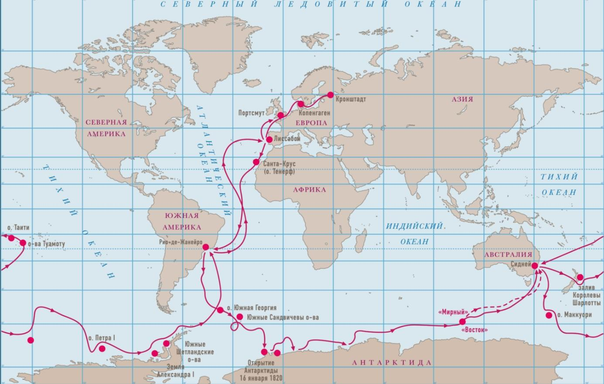

# SimpleMap

Экспедеция Беллинсгаузера, открытие Антарктиды.

## Страницы

- [SimpleMap](#simplemap)
  - [Страницы](#страницы)
  - [Главная страница](#главная-страница)
  - [Страница с картой](#страница-с-картой)
    - [Основные возможности](#основные-возможности)
  - [Отдельные интерактивные страницы](#отдельные-интерактивные-страницы)
  - [Страница с историческими лицами](#страница-с-историческими-лицами)
  - [Страница о нас](#страница-о-нас)
  - [Страница атлас?](#страница-атлас)
  - [Redmine](#redmine)
    - [Задачи:](#задачи)
      - [Григорий Воробьёв](#григорий-воробьёв)
      - [София Шестакова](#софия-шестакова)
      - [Вика Зверева](#вика-зверева)

## Главная страница

Основная информация про Антарктиду, кто открыл, в каком году, почему исследование Антарктиды так важно. Предыстория.

## Страница с картой

### Основные возможности

* Интерактивная карта с путешествием ***Беллинсгаузена***, с возможностью выбора антарктиды на карте, и открыть как отдельную карту (погружение).  

* Таймлайн с возможностью выбора промежутка времени путешествия

* Точки событий на карте (остановки, и т.д), при нажатии открывает окно с информацией о событии.

## Отдельные интерактивные страницы

**Интерактивная карта** для конкретного места, с более подробной информацией (маршрут экспедиции, события на карте)

***Что может быть:***

  * Интересные факты

## Страница с историческими лицами

Фотографии исторических лиц, вместе с информацией о них.

## Страница о нас 

**Что будет на странице:**

* Наши фотки, кто что делал, ссылка на `Github`

## Страница атлас? 

Атлас 1831-го года

## Redmine

### Задачи:

#### Григорий Воробьёв

Основные задачи:

* Базовая реализация интерактивной карты на странице.
* Разработка таймлайна для карты.

- - -

#### София Шестакова

* Написание и утверждение плана.
* Подбор цветовой гаммы на сайт.
* Поиск и структурирование информации.

- - -

#### Вика Зверева

* Поставить задачи на редмайн.
* Начать делать инициацию проекта (обсуди с Соней)
* Поиск и структурирование информации.