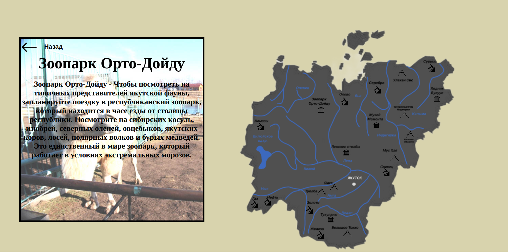
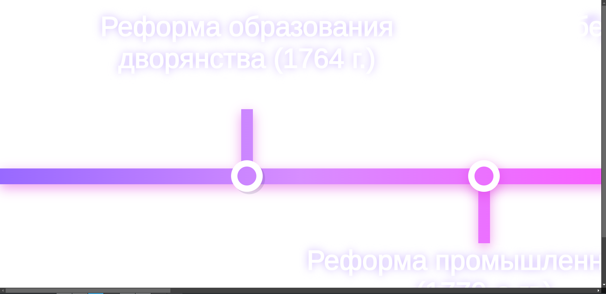
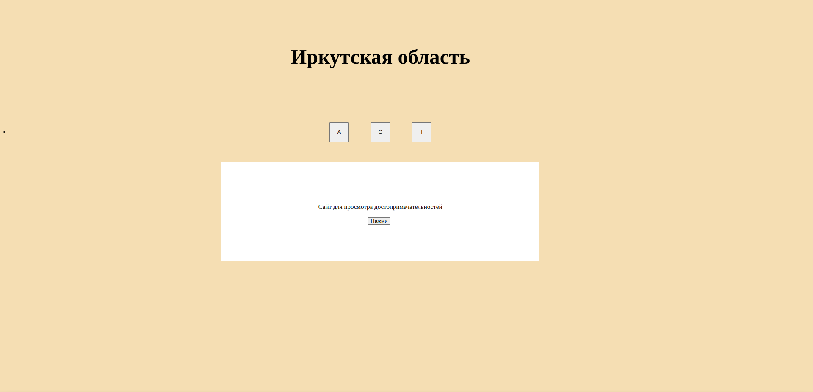
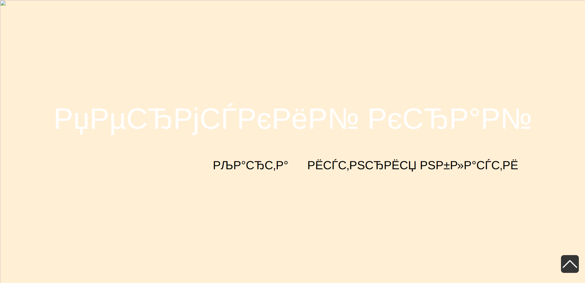

# Инициация проекта SimpleMap

## План инициации

1. [**Анализ конкурентов**](#анализ-конкурентов)  
2. **Cписок заинтересованных лиц**  

## Анализ конкурентов

### Кто наши конкуренты?

Если рассматривать **данный проект** исключительно как **локальный**, акцентируя внимание только на основной, требуемой от нас цели - сделать сайт по истории по определённой теме, т.е рассматривать в рамках проекта по истории, за которую мы получим оценку, то нашими основными *"конкурентами"* будут являться, конечно же, <ins>**однокурсники**</ins>.

Однако, для **анализа**, ни что не мешает нам смотреть на уже существующие проекты в просторах *богомерзкого* интернета, с похожей целью.

> [!NOTE]
> Так как проект начался относительно недавно, мы не можем на данный момент найти хороших решений в проекте среди однокурсников, однако мы можем спрогнозировать их поведение, на основе второго курса.

В целом, если говорить про **конкурентов**, мало у кого вообще есть ***интерактивная карта***, а у тех, у кого она есть, по качеству и ***интерактивности*** оставляет желать лучшего.

Основные проблемы, которые я для себя подметил, анализируя опыт прошлого курса, это:

* **Недостаток интерактивности**
    
  Единственный интерактив на сайте - **карта**, она статична, как и точки на ней, при нажатии на которых, появляется информация о месте.

  

* **Неадаптивный сайт**  
  
  Абсалютное позиционирование, точечное обозначение масштаба элементов, танцы с бубнами при написании стилей делают сайт банально не удобным, или даже не читабельным на некоторых устройствах.

  

* **Убогий дизайн**  
  
  Текст с убогим шрифтом, на убогом фоне, с убогими фантазиями сей величайшего дизайнера делают сайт убогим во всём.

  

* **Непонятная структура**  
  
  О чём он вообще думал, когда взялся за проект?

  

