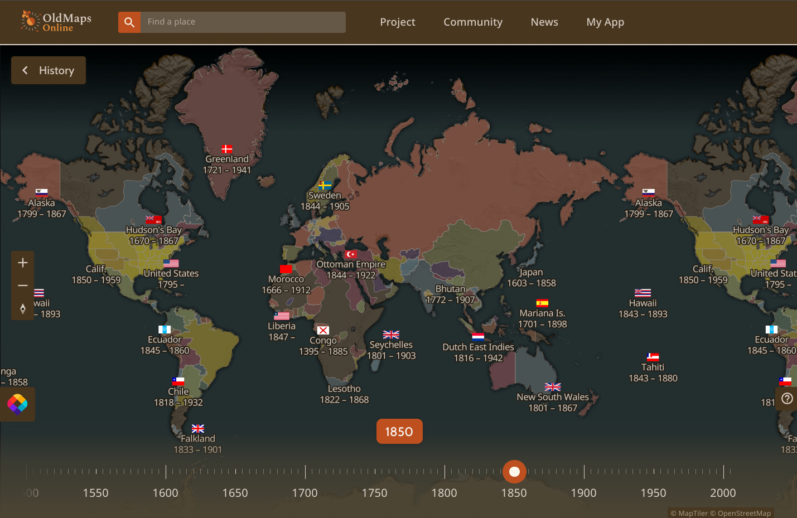
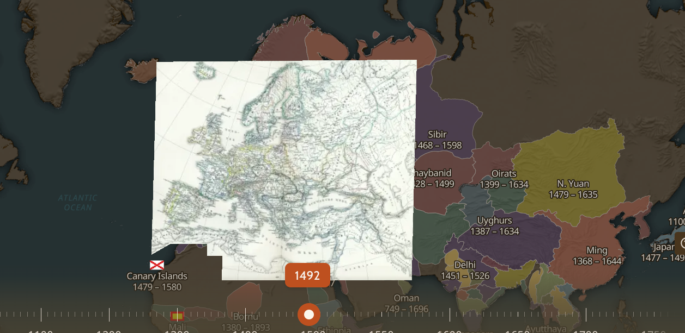
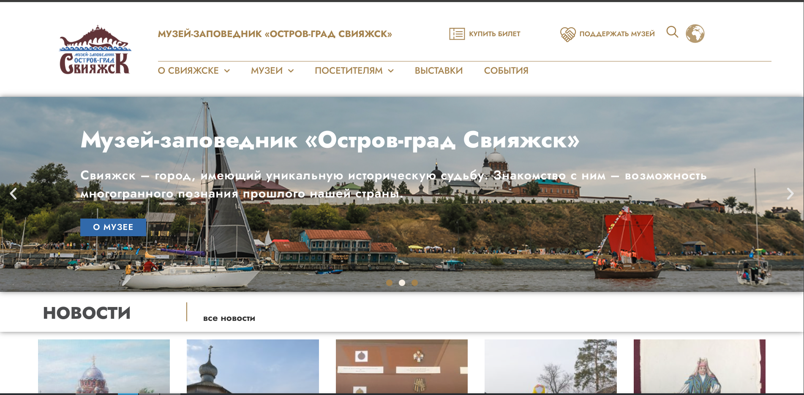
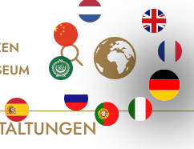
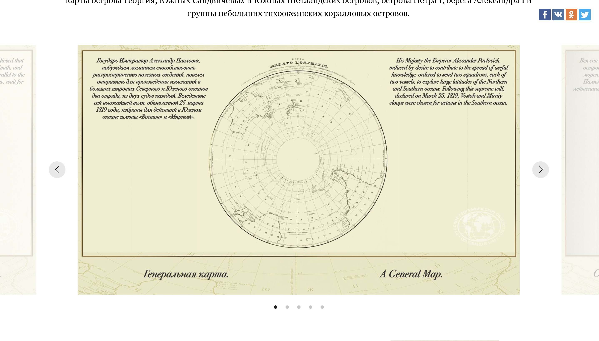
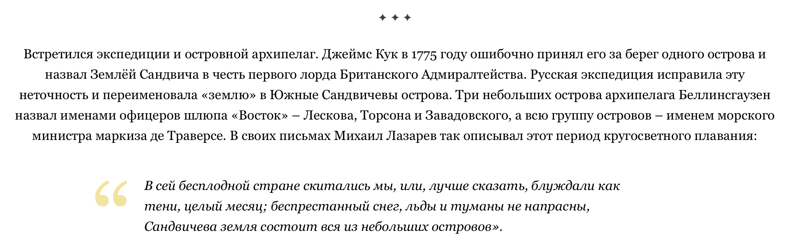
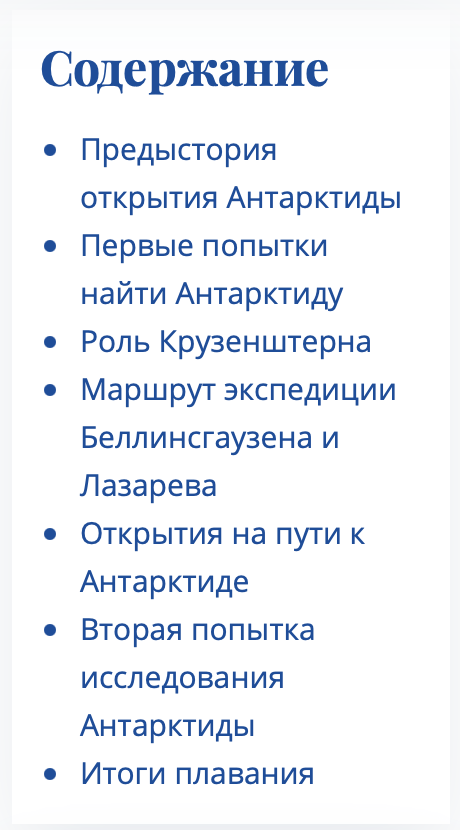
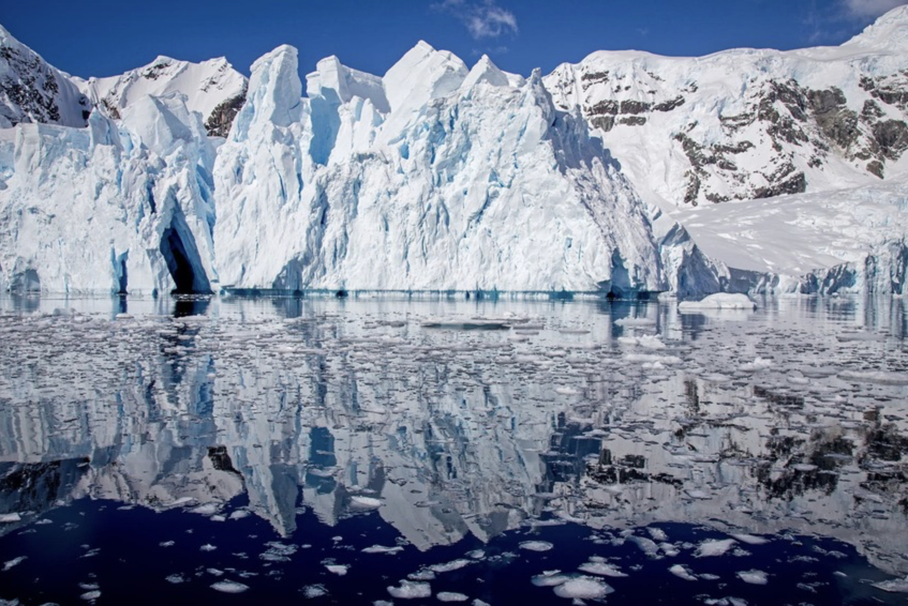

# Инициация проекта SimpleMap

## План инициации

1. [**Анализ конкурентов**](#анализ-конкурентов)
2. [**Cписок заинтересованных лиц**](#cписок-заинтересованных-лиц)
3. [**Рабочая коммуникация**](#рабочая-коммуникация)

## Анализ конкурентов

### Кто наши конкуренты?

Если рассматривать **данный проект** исключительно как **локальный**, акцентируя внимание только на основной, требуемой от нас цели - сделать сайт по истории по определённой теме, т.е рассматривать в рамках проекта по истории, за которую мы получим оценку, то нашими основными *"конкурентами"* будут являться, конечно же, <ins>**однокурсники**</ins>.

Однако, для **анализа**, ни что не мешает нам смотреть на уже существующие в просторах *богомерзкого* интернета проекты, с похожей целью.

> [!NOTE]
> Так как проект начался относительно недавно, мы не можем на данный момент найти хороших решений в проекте среди однокурсников, однако мы можем спрогнозировать их поведение, на основе второго курса.

В целом, если говорить про **конкурентов**, мало у кого вообще есть ***интерактивная карта***, а у тех, у кого она есть, по качеству и ***интерактивности*** оставляет желать лучшего.

- - -

### Основные проблемы, которые я для себя подметил, анализируя опыт прошлого курса, это:

* **Недостаток интерактивности**
    
  Единственный интерактив на сайте - **карта**, она статична, как и точки на ней, при нажатии на которых, появляется информация о месте.

  

* **Неадаптивный сайт**  
  
  Абсалютное позиционирование, точечное обозначение масштаба элементов, танцы с бубнами при написании стилей делают сайт банально не удобным, или даже не читабельным на некоторых устройствах.

  

* **Убогий дизайн**  
  
  Текст с убогим шрифтом, на убогом фоне, с убогими фантазиями сей величайшего дизайнера делают сайт убогим во всём.

  

* **Непонятная структура**  
  
  О чём он вообще думал, когда взялся за проект?

  

Но конечно, не все **подходы** к решению тех или иных **задач** и их **реализации**, среди наших ***конкурентов*** *(однокурсников, других похожих проектов)* **являются плохими**, можно найти вполне **хорошие примеры сайтов**, которые можно для себя <ins>**подметить**</ins>, давайте же разберём некоторые примеры.

## Примеры наших *"конкурентов"*

> [!NOTE]
> Думаю, нет смысла постоянно расписывать одни и те же пункты (`плюсы`, `минусы`), и повторять то же самое, чтобы не делать разбор чересчур <ins>**исчерпывающим**</ins>, так что пункты, которые были уже были **расписаны**, расписываться не будут, если только они не будут отличаться от других.  

- - -

### Примеры

  1. [OldMaps Online](#oldmaps-online) - Отличнейший пример интерактивной карты
  2. [Музей-заповедник «Остров-град Свияжск»](#музей-заповедник-остров-град-свияжск)
  3. [Открытие Антарктиды](#открытие-антарктиды)
  4. [Клуб Полярных](#кто-открыл-антарктиду)

- - -

### [OldMaps Online](https://www.oldmapsonline.org/)

### Плюсы

* **Уникальная реализация интерактивной карты на странице:**
  
  * **Наличие фильтра**  
   Сделать например так, чтобы карта **показывала** имена ***правящих страной лиц***, отобразить ***войны***, происходящие в определённый промежуток времени.
  
  * **Возможность наложения сторонней карты на карту**
  
    

    Да-да, так тоже можно, более того, вы можете загрузить и настроить свою карту на данный сайт, чтобы другие могли использовать её.
  
  * **Таймлайн для карты**
  
    Отображать карту в конкретный временной период? - Да.

### Минусы

* **Неоптимизированность**  
  Сайт большой и громоздкий, некоторые элементы грузятся долго, даже с нормальным интернетом.

* **Баги**  
  Бывает, что сайт может просто зависнуть, или несколько карт наложатся одним за другим так, что их не убрать, кроме как перезагрузить сайт.

Это один из немногих (если такие вообще есть) сайтов, где так много возможностей по работе с картами.

**OldMapsOnline** использует **MapTiler** - инструмент, для работы с картами, который в свою очередь обрабатывает **исторические карты**, и преобразует карты в формат `MBTiles` или набор **веб-тайлов** (например, `PNG` или `JPEG`), совместимых с современными картографическими библиотеками, такими как **Leaflet** или **OpenLayers**.

> [!TIP]
>`OldMapsOnline` и `MapTiler` связаны через одних и тех же разработчиков. `OldMapsOnline` — это проект, который изначально был создан при участии *Петра Придаля* и его команды в ***Klokan Technologies GmbH***, той же компании, что разработала `MapTiler`.

- - -

### [Музей-заповедник «Остров-град Свияжск»](https://ostrovgrad.ru/)

#### Плюсы

* **Дизайн:**  
  Минималистичный и не мазолит глаза.
* **Понятная структура:**  
  Текст структурирован, и нетрудно догадаться, что где находится.
* **Информативность:**  
  С первой же страницы, можно понять, где находится этот музей, и что можно о нём узнать.
* **Актуальность:**  
  На сайте отображается актуальные сведения о музее, новости, мероприятия, события.

#### Минусы

* **Сайт полностью неадаптивный**  
  Это не удобно, особенно на смартфонах.

* **Малое количество интерактивности**  
  Не всегда обязательно, но с интерактивностью становится привлекательнее.

#### Особенности

* Перевод содержания на несколько языков
  
  

#### Вывод

В целом, из идей, которые мне понравились, и которые можно внедрить в наш проект, это актуальная новостная лента и перевод содержания на несколько языков.

- - -
### [Открытие Антарктиды](https://antarktida.rgo.ru)

#### Плюсы

* **Есть атлас:**  
   

  Атлас 1831 года. Считается, что карты из него были созданы самим Беллинсгаузеном. Это довольно интересно узнать.

 * **Интересная информация:**  
 На сайте представлены интересные факты и информация об экспедиции.

#### Минусы

* **Дизайн:**  
  Текст довольно сложно воспринимать в таком формате, так как он выровнен по центру. Создается впечатление, что он не структурирован. Глаза устают от такого оформления.

   

* **Интерактивность совсем оцутствует**  
  Это не всегда обязательно, но с интерактивностью изучать информацию становится гораздо интереснее. Чем увлекательнее подача информации, тем лучше она запоминается. Я считаю, что интерактивность с пользователем очень важна.

* **Нет карт:** 
  
  На сайте отсутствуют карты, что снижает его информативность и ценность.

- - -
### [Кто открыл Антарктиду](https://polartravelclub.ru/info-for-travelers/articles/kto-otkryl-antarktidu-istoriya-otkrytiya-poslednego-materika/)

 

#### Плюсы

* **Структурированная информация:**  
 На сайте справа расположено содержание, где можно выбрать нужный раздел и сразу перейти к соответствующей части текста. Это удобно для навигации и быстрого поиска информации. 

   
  
* **Картинки:**  
  На сайте представлены красивые фотографии Антарктиды, которые добавляют визуальной привлекательности и помогают лучше прочувствовать атмосферу этого уникального континента.

   

#### Минусы

* **Огромные блоки текста**  
  На сайте встречаются большие, неразделенные блоки текста, которые сложно воспринимать. Такое оформление не вызывает желания вчитываться и углубляться в материал.

* **Интерактивность**  
  Её практически нет. Единственный элемент интерактивности — это возможность перехода по пунктам содержания. Однако этого недостаточно, чтобы сделать сайт по-настоящему увлекательным и интересным.

* **Карты** 
 
  На сайте отсутствуют карты, которые могли бы наглядно показать маршруты экспедиций или географические особенности Антарктиды. Это существенно снижает информативность ресурса и его ценность для тех, кто интересуется историей открытий.

#### Вывод 
  Исходя из просмотренных сайтов на просторах интернета, к сожалению, в сети не так много действительно интересных ресурсов, посвященных открытию Антарктиды. Практически ни один из них не предлагает интерактивности, которая могла бы увлечь пользователя, и крайне редко встречаются исторические карты, способные оживить повествование. Текст на большинстве ресурсов подается огромными, неструктурированными блоками, которые не только сложно воспринимать, но и не вызывают желания углубляться в материал. Кроме того, дизайн и оформление зачастую оставляют желать лучшего, что делает процесс изучения информации менее приятным и удобным.

- - -

## Cписок заинтересованных лиц

* [Заказчик](#заказчик)
* [Проектный менеджер](#проектный-менеджер-pm)
* [Преподаватель истории](#преподаватель-истории)

### Заказ

Разработать исторический сайт по конкретной теме, включающий в себя интерактивную карту и использующий язык программирования (например `JavaScript`)

- - -

### Заказчик

<ins>**Грохульский Максим Сергеевич**</ins> - заказчик, технический директор (если так можно выразится).

> [!TIP]
> Так же является ревьювером кода, и в конечном счёте именно он выставляет оценку за техническую часть проекта.

#### Что требует

Грубо говоря, чтобы в нашем проекте использовался язык программирования, т.е у сайта была своя логика (*привет,* ***интерактивные карты***).

Также код должен быть понятный, чтобы мы могли его объяснить, а другие понять (пока, `StackOverFlow`).

В конечном счёте мы должны научится применять свои технические навыки в проектах, и использовать их для достижения тех или иных целей.

- - -

### Проектный менеджер (PM)

<ins>**Незнанов Евгений Дмитриевич**</ins> - проектный менеджер.

> [!TIP]
> Так же является ревьювером ведения проектного управления.

Ставит оценку за **ведение проекта**: то как команда выставляла задачи на `RedMine`, как они выполнялись, как часто, и выполнялись ли в срок.

#### Что требует

Работа в `Redmine`, различные документы: **инициация**, **планирование**, **эстимация** (декомпозиция задач и оценка стоимости).  
Грубо говоря, грамотное ведение проекта.

- - -

### Преподаватель истории

<ins>**Василевский Александр Викторович**</ins> - преподаватель, ревьювер исторического содержания.

> [!TIP]
> В конечном счёте ставит оценку за **историческое содержание**.

> [!WARNING]
> Может пояснить за дизайн.

#### Что требует

Структурированное, подлинное и понятное историческое содержание, без лишней воды, самое основное.

Сайт должен выглядеть <ins>**адекватно**</ins>.

## Рабочая коммуникация

Созвон - каждый **вторник** (`Weakly`): кто что сделал, делает, какие задачи кто закрыл; выставление следующих задач, планирование будущих действий.

## Каналы коммуникации

| Имя ревьювера      | Область | Дни коммуникации         |
|---------------------|---------|--------------------------|
| **Евгений Незнанов**   | **PM**      | среда: 2 пара,   пятница: 1-2 пара |
| **Не опрелелён** | **Программирование** | **Неизвестно** |
| **Николай Колесников** | **UI-UX дизайн** | **Неизвестно** |
| **Александр Василевский** | **История** | **Неизвестно** |

### Команда

<ins>**Григорий Воробьёв**</ins> - техническая часть.

<ins>**София Шестакова**</ins> - дизайнер.

<ins>**Вика Зверева**</ins> - проектный менеджер (`PM`).
